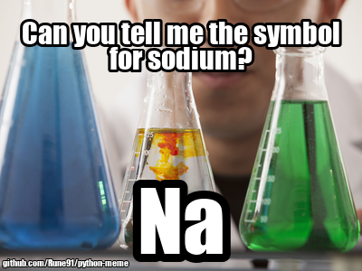

# python-meme

Tool to automatically generate a top+bottom text meme from only the following input:
- `string` image search keywords
- `string` top text
- `string` bottom text

## Usage

1. Download *meme_creator.py* and *unicode-impact.ttf* to the same folder.
2. Make your own code file with this sample content:

```
from meme_creator import MemeCreator
meme_creator = MemeCreator()

image_keywords = "chemistry"
top_text = "Can you tell me the symbol for sodium?"
bottom_text = "Na"
meme = meme_creator.make(image_keywords, top_text, bottom_text)
meme.show()
meme.save("my_meme.png", "PNG")
```

3. Save your code file to the same folder and run. The following image is produced:

